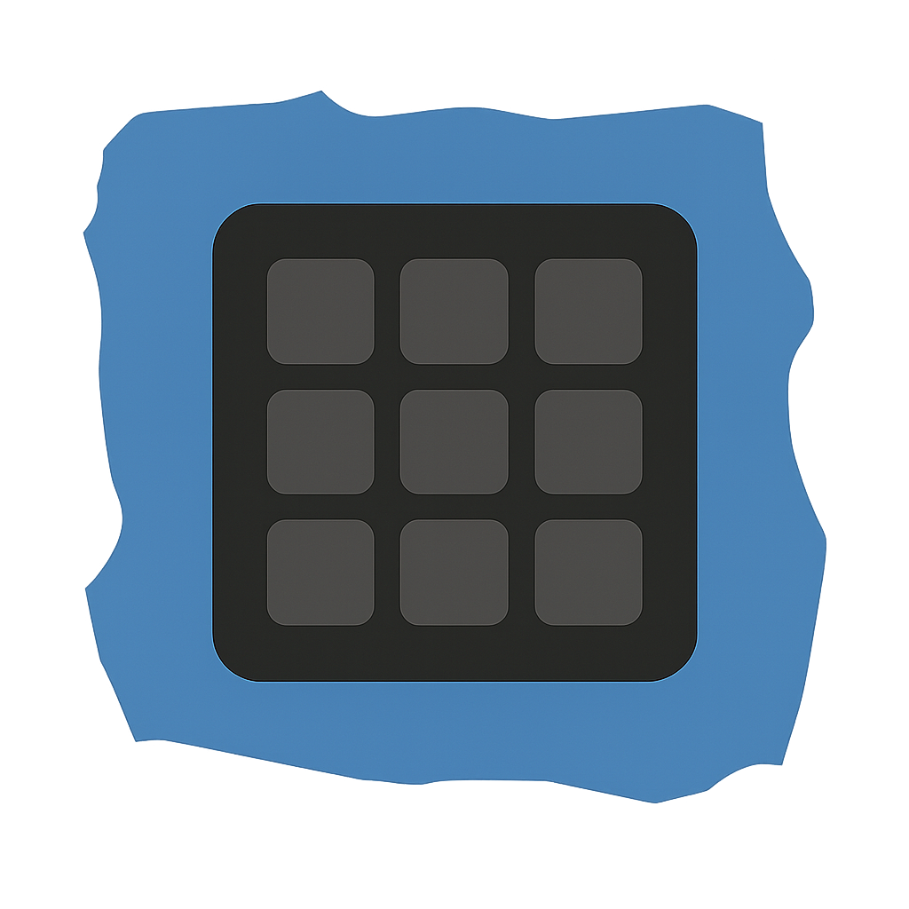

# Stream Dork

A virtual stream deck overlay for Windows, built with Electron. Stream Dork provides a customizable button grid that floats on top of your applications, allowing quick access to actions and plugins compatible with the Stream Deck SDK.



## Features

- **Customizable Button Grid** — Configure rows and columns to match your workflow
- **Stream Deck SDK Compatible** — Use existing Stream Deck plugins with minimal or no modifications
- **Overlay Mode** — Transparent, always-on-top overlay that appears with a keyboard shortcut
- **Property Inspectors** — Full support for plugin configuration via embedded webviews
- **Icon Libraries** — Ship with icon packs or use custom icons from your filesystem
- **Animated Transitions** — Spiral entry/exit animations with configurable direction and start corner
- **Auto-Dismiss** — Optional automatic hiding after a configurable delay
- **Keyboard Filtering** — Type to quickly filter and find buttons
- **Multi-Language Support** — Plugin i18n via Stream Deck's localization format
- **System Tray** — Runs in the background with quick access from the system tray

## Keyboard Shortcuts

| Shortcut | Action |
|----------|--------|
| `Ctrl+Alt+Space` | Toggle overlay visibility |

## Getting Started

### Prerequisites

- Node.js 18+
- npm

### Development

```bash
# Install dependencies
npm install

# Run in development mode (hot-reload enabled)
npm run dev
```

This starts both the Vite dev server (for the renderer) and Electron. The app will open automatically.

### Building for Windows

#### Option 1: Build on Windows

```bash
npm run build
npm run build-electron
```

#### Option 2: Build from Linux/WSL using Docker

```bash
./build-docker.sh
```

This uses the `electronuserland/builder:wine` Docker image to cross-compile for Windows. The output will be in `dist-electron/`.

To create a distributable zip:

```bash
npm run zip-windows
```

## Using Stream Deck Plugins

Stream Dork is compatible with Stream Deck plugins that support Windows. You can use existing plugins from the [Stream Deck Store](https://apps.elgato.com/) or community plugins.

### Installing Plugins

1. **Download or obtain a Stream Deck plugin** (`.sdPlugin` folder)
2. **Place the plugin folder** in the `plugins/` directory:
   ```
   plugins/
   └── com.example.plugin.sdPlugin/
       ├── manifest.json
       ├── plugin.exe
       └── ...
   ```
3. **Restart Stream Dork** — Plugins are automatically discovered on startup

### Plugin Requirements

For a plugin to work with Stream Dork, it must:

- **Support Windows** — The plugin's `manifest.json` must declare Windows in the `OS` array
- **Use WebSocket communication** — Follow the Stream Deck SDK protocol
- **Have a valid manifest** — Include required fields: `Name`, `Version`, `SDKVersion`, and `Actions`

### Using Plugins

1. Open the **Setup** window (from system tray or `Ctrl+Alt+Space` then close overlay)
2. In the right sidebar, you'll see available actions from all installed plugins
3. **Drag and drop** actions onto the button grid to add them
4. **Click a button** to configure it using the plugin's Property Inspector (if available)

### Plugin Compatibility

Stream Dork implements a subset of the Stream Deck SDK. Most plugins that work on Windows should function, but some features may not be available:

- ✅ Button actions and states
- ✅ Property Inspectors
- ✅ Settings and global settings
- ✅ Application monitoring
- ✅ Multi-language support
- ❌ Some macOS-specific features
- ❌ Hardware-specific features (rotary encoders, touch strips, etc.)

If a plugin doesn't work, check the application logs for error messages.

## Project Structure

```
├── src/
│   ├── main.cjs              # Electron main process
│   ├── preload.js            # Preload script for IPC
│   ├── host/                 # Stream Deck host implementation
│   │   ├── streamdeck-host.cjs    # WebSocket server & plugin communication
│   │   ├── plugin-discovery.cjs   # Plugin manifest parsing & loading
│   │   └── icon-library-discovery.cjs
│   ├── components/           # React components
│   ├── pages/                # Electron windows (setup, overlay)
│   ├── lib/                  # Utilities and state management
│   └── styles/               # Global CSS
├── icons/                    # Icon libraries
└── dist-electron/            # Build output
```

## Configuration

Configuration is stored in the Electron `userData` directory:
- **Windows**: `%APPDATA%/stream-dork/config.json`

### Grid Settings

- Rows and columns
- Button size and radius
- Background color and opacity
- Overlay position (corners, center, or custom coordinates)
- Animation settings (duration, direction, start corner)

## Debugging

### Application Logs

Logs are written daily to the `logs/` folder in your userData directory:
- **Windows**: `%APPDATA%/stream-dork/logs/YYYY-MM-DD.txt`

Logs include:
- Window events (show, hide, focus, blur)
- IPC messages
- Plugin registration and communication
- Errors and stack traces

### Plugin Communication Logs

WebSocket messages between Stream Dork and plugins are logged to:
- `%APPDATA%/stream-dork/comm_YYYY-MM-DD.txt`

### Chrome DevTools Protocol

Stream Dork enables remote debugging on port **23519**. This allows debugging Property Inspectors in your browser:

1. Open Chrome/Edge
2. Navigate to `http://localhost:23519`
3. Select the webview to inspect

### Debug Panel

Launch Stream Dork with the `--stream-dork-control-panel` flag to show the debug panel in the setup window:

```bash
# Development
npm run dev -- --stream-dork-control-panel

# Production
./StreamDork.exe
```

The debug panel shows:
- Connected plugins and their status
- Active contexts
- Real-time host logs

### Renderer DevTools

In development or when running the app:
- Use `Ctrl+Shift+I` or the View menu to open DevTools
- View → Toggle DevTools

## Plugin Development

Stream Dork implements a subset of the [Stream Deck SDK](https://docs.elgato.com/sdk). Plugins must:

1. Have a `manifest.json` with Windows OS support declared
2. Implement WebSocket communication per the SDK spec
3. Be placed in the `plugins/` folder as `*.sdPlugin` directories

### Supported Events

**From Host to Plugin:**
- `willAppear` / `willDisappear`
- `keyDown` / `keyUp`
- `didReceiveSettings` / `didReceiveGlobalSettings`
- `propertyInspectorDidAppear` / `propertyInspectorDidDisappear`
- `applicationDidLaunch` / `applicationDidTerminate`

**From Plugin to Host:**
- `setSettings` / `getSettings`
- `setGlobalSettings` / `getGlobalSettings`
- `setTitle` / `setImage` / `setState`
- `showAlert` / `showOk`
- `openUrl`
- `logMessage`
- `sendToPropertyInspector`

### Property Inspectors

Property Inspectors are HTML pages that configure plugin actions. They communicate with the plugin via `sendToPlugin` and `sendToPropertyInspector` events.

## Tech Stack

- **Electron** — Desktop application framework
- **React 19** — UI library
- **Vite** — Build tool and dev server
- **TypeScript** — Type safety
- **Zustand** — State management
- **TailwindCSS** — Styling
- **Motion** — Animations (Framer Motion)
- **shadcn/ui** — UI components
- **WebSocket** — Plugin communication

## License

MIT
